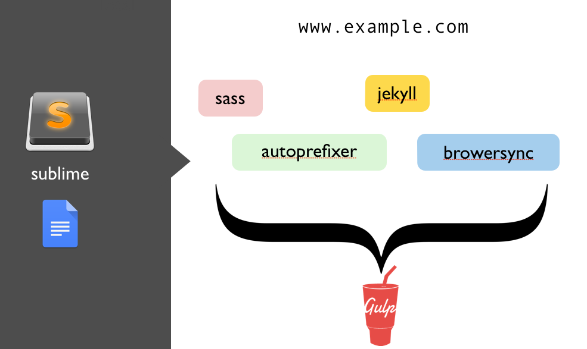

## 第一节  jekyll&gulp 开发环境简介

展示整个环境的妙用。

Jekyll 的功能很多，但是我这里会用的就是它的文件拼接功能。因为开发的代码比较多，都写到一个页面上就很乱套，所以要分割为一个个的小片段，然后 Jekll 就可以帮助我们拼接成一个页面。
主要是展示整个环境，各个部分的功能，让大家感觉有意思，不用细说。

## 第二节 安装 gulp 和 sass

我用的是 aliyun 的服务器，但是域名要备案。所以可以选择国外服务器，或者本地搭建虚拟机。

使用 Gulp 参考了这个项目： <https://github.com/shakyShane/jekyll-gulp-sass-browser-sync>

<https://www.npmjs.com/package/gulp-sass> 上的 gulpfile 内容有问题，运行不了。下面是正确的 gulpfile.js 文件：


var gulp = require('gulp');
var sass = require('gulp-sass');

gulp.task('sass', function () {
  return gulp.src('_scss/main.scss')
         .pipe(sass())
         .pipe(gulp.dest('./css'));
});

gulp.task('watch', function () {
  gulp.watch('_scss/*.scss', ['sass']);
});


gulp 的插件系统不是闹着玩？css minfiy ， image compression ... 各种强大功能都有。

顺便提一个常见问题：现象是这样。修改 _scss/*.scss 中的内容，gulp 终端的信息都是 `0 file changed`，到页面上看，任何修改都不生效，但是也不报错，基本上就是 sass 任务运行了，但是没有编辑任何文件。 原因是这样，_scss/_layout.scss 我删除了，但是 main.scss 中忘了删相应的 @import 语句，也就是说 gulp-sass 当遇到某些错误的时候是不报错的。这个给我的教训是，这个很难定位错误，用了我半小时的时间才解决。所以还是要在调代码的时候慢一点，多测试。

## 第三节 jekyll 和 browsersync


gem install jekyll


这个需要装。
