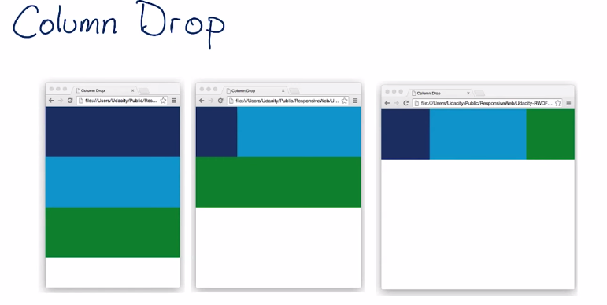
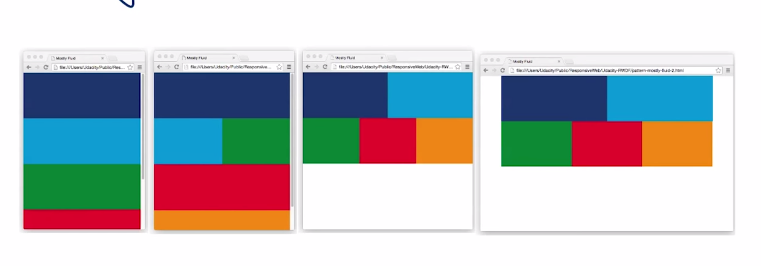
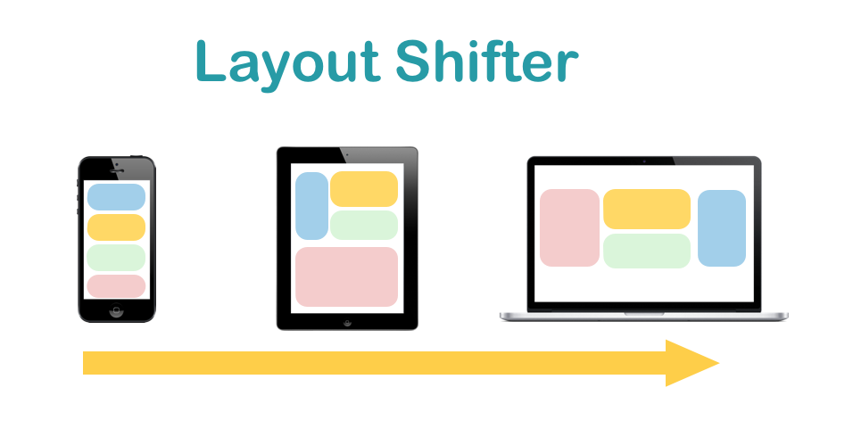
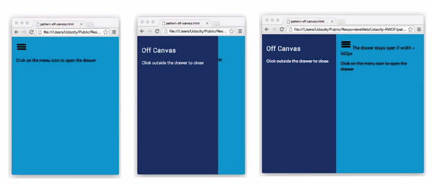

有意或者无意之间，我们的网页总会归于某种”响应式模式“（ Responsive Patterns ），这里来介绍一下几种常见的模式，相信是非常有启发性的。

非常常见的一种情况是，在手机上，网站内容是单列布局的，到了桌面电脑上面就变成了多列结构。所谓”模式“，要解决的重要问题，就是在临界点发生的时候，网站布局改做出怎样的变化。

常见的模式有四种，并且有时候也可以在一个页面上混合两种模式来使用。

下面的主要内容和各个图片都来自[这篇文档](https://github.com/santhoshvai/Responsive-Web-Design-Fundamentals/wiki/4-Common-Responsive-patterns)

### Column Drop

最窄的屏幕上，所有元素就垂直一个跟一个排成一列。 屏幕变宽时，到达第一个临界点后，第一个和第二个元素就变成左右两列排布了。



  

  

  




.container {
    display: flex;
    flex-wrap: wrap;
}
.box {
    width: 100%;
}
@media screen and (min-width: 450px) {
    .dark_blue {
        width: 25%;
    }
    .light_blue {
        width: 75%;
    }
}
@media screen and (min-width: 450px) {
    .dark_blue,
    .green {
        width: 25%;
    }
    .light_blue {
        width: 50%;
    }
}


### Mostly Fluid

<!-- 文字内容就参考 https://www.udacity.com/course/viewer#!/c-ud893/l-3561069759/m-3484798853 -->
<!-- 给出一个实际中采用这种方案的例子 -->

跟前面的 Column Drop 一样，当屏幕最窄的时候，元素一个跟一个排成一列。当布局开始变宽，会出现网格模式。宽到一定程度，主体内容的左右两侧就会出现 margin ，而不是让主体内容一直跟着 viewport 来变宽。



  

  

  

  

  




.container {
    display: flex;
    flex-wrap: wrap;
}
.box {
    width: 100%;
}
@media screen and (min-width: 450px) {
    .light_blue,
    .green {
        width: 50%;
    }
}
@media screen and (min-width: 550px) {
    .dark_blue,
    .light_blue {
        width: 50%;
    }
    .green,
    .red,
    .orange {
        width: 33.33333%;
    }
}
@media screen and (min-width: 700px) {
    .container {
        width: 700px;
        margin-left: auto;
        margin-right: auto;
    }
}


<http://www.html5rocks.com/en/> 就是属于这种情况的一个例子。

### Layout Shifter

这种方式就比较灵活了，不仅仅跟前面的两种方式一样，随着屏幕变宽，单列布局变多列。这种方式的特点是各个元素的摆放位置不在遵循原来的顺序，而可以根据需要任意调整。



  

  

    

    

  

  




.container {
    width: 100%;
    display: flex;
    flex-wrap: wrap;
}
.box {
    width: 100%;
}
@media screen and (min-width: 500px) {
    .dark_blue {
        width: 50%;
    }
    #container2 {
        width: 50%;
    }
}
@media screen and (min-width: 600px) {
    .dark_blue {
        width: 50%;
        order: 1; /* appear last, default value is 0*/
    }
    #container2 {
        width: 50%;
    }
    .red {
        width: 50%;
        order: -1; /* appear first, default value is 0*/
    }
}


[这里](https://developers.google.com/web/fundamentals/layouts/rwd-patterns/layout-shifter?hl=en)给出了一些这种策略的实例。

### Off Canvas

另一种叫 [Off Canvas](https://www.udacity.com/course/viewer#!/c-ud893/l-3561069759/m-3530719305)，就是当在手机上显示的时候，把一些不常用的页面元素隐藏起来，当然要有一个汉堡包按钮能很方便的让他们显示出来。而当屏幕空间足够的时候，直接显示前面被隐藏的内容，例如一个导航栏。


<nav id="drawer" class="dark_blue">
</nav>
<main class="light_blue">
</main>



html,
body,
main {
    width: 100%;
    height: 100%;
}
nav {
    width: 300px;
    height: 100%;
    position: absolute;
    transform: translate(-300px, 0);
    transition: transform 0.3s ease;
}
nav.open {
    transform: translate(0, 0);
}
/* breakpoint that repositions everything back to its normal spot */
@media screen and (min-width: 600px) {
    nav {
        position: relative;
        transform: translate(0, 0);
    }
    body {
        display: flex;
        flex-flow: row nowrap;
    }
    main {
        width: auto;
        flex-grow: 1;/* Allows the element to grow and take up the full remaining width of the viewport*/
    }
}


还要配合一些 js 代码：


menu.addEventListener('click', function(e) {
    drawer.classList.toggle('open');
    e.stopPropagation();
})


下图来自 <https://www.canva.com/> ：

<!-- http://teamtreehouse.com/library/responsive-layouts
 -->

### 参考

- [google&udactiy 课程](https://www.udacity.com/course/viewer#!/c-ud893/l-3561069759/e-3529819408/m-3571808936)
