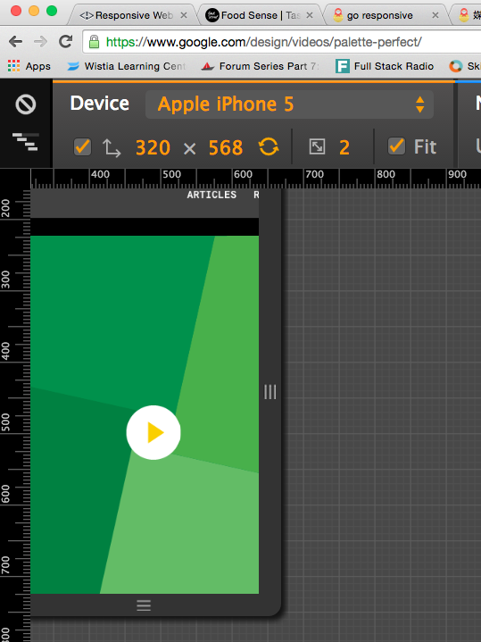

响应式网站设计只有弹性布局这一个技巧是不够用的。有时候浏览器的视窗宽度可能会太小，小到甚至按比例缩放布局也会出现特别小的栏框，以至于网站内容不能有效地显示。尤其是当网站布局变得很小或很大的时候，网站上的文字可能会变得难以辨认，网站布局也可能会被打乱。这时候，media queries 就派上用场了，它能帮助你设计出更好的用户体验。

媒体查询（ media queries ）是对媒体类型（ media types ）的一次扩展，通常媒体类型会出现在链接 css 样式文件的时候。媒体查询可以为单个浏览器和设备类型指定不同的样式，诸如视窗（ viewport ）宽度或者设备方向， 对设备的判断能力进一步加强了。这种给不同设备使用其专属样式的能力，为响应式网站设计开启了一片新的天地。

在 CSS2.1 中定义了媒体类型，通过给 `<link>` 元素添加 media 属性，可以为不同的媒体类型加载不同的样式表。


<link rel="stylesheet" href="main.css" media="screen">


### 初始化媒体查询

媒体查询有两种不同的使用方法，一种是在已有的样式表文件中使用 @media 规则，另一种是使用 @import 规则导入一张新的样式表，或在 HTML 文档中链接到一个单独的样式表文件。通常来说，推荐使用的方法是在已有的样式表文件中使用 @media 规则，避免增加额外的 HTTP 请求。


<!-- Separate CSS File -->
<link href="main.css" rel="stylesheet" media="screen and (min-width: 480px)">



/* @media Rule */
@media screen and (min-width: 480px) {...}

/* @import Rule */
@import url(main.css) screen and (min-width: 480px) {...}


每一个媒体查询可能会包含一个媒体类型，紧接着是一个或多个表达式。常见的媒体类型包括 all、screen、print、tv 和 braille。HTML5 规范包含了新的媒体类型，甚至包括三维眼镜。若媒体查询中没有指定媒体类型，则默认为 screen。

媒体查询表达式可能包括不同的媒体特性与值，表达式计算结果是 true 或 false。若结果为 true 的话，就会应用其包裹的样式。若结果为 false，则忽略其包裹的样式。

### 媒体查询操作符

媒体查询中的逻辑操作符可以构建强大的表达式。共有三个逻辑操作符，分布是 and、not 和 only。

在媒体查询中使用 and 逻辑操作符可以添加新的表达式，并且浏览器或设备必须满足列出的所有条件，才能执行相关的 css 样式。多个媒体查询之间用逗号分隔开。举例说明，若选择宽度介于800像素到1024像素之间的所有媒体类型，该如何表示呢？


@media all and (min-width: 800px) and (max-width: 1024px) {...}


not 逻辑操作符对后面的表达式取反操作。下面的示例，css 样式将应用于非彩色屏幕的设备


@media not screen and (color) {...}


only 逻辑操作符是一个新出现的运算符，使用 HTML4 算法的浏览器并不支持它，这样一些较老的，不支持媒体查询的浏览器就不能使用给定的样式了。


@media only screen and (color) {...}


当使用 not 和 only 逻辑操作符的时候，如果没有指明媒体类型，则默认值为 all。

另外媒体查询是大小写敏感的，若媒体查询语句中包含未知名媒体的媒体类型，则计算结果为 false。

### 媒体特征

虽然已经知道了媒体查询的语法，逻辑操作符的用途，再来学习一下，真正起作用的媒体特征（ media features ）。在媒体查询表达式中，媒体特征能够识别设备的属性。

高度 & 宽度

最常见的一个媒体特征，就是用来确定一个设备或浏览器视窗（ viewport ）的高度和宽度。借助 height、width、device-height、device-width 媒体特征可以得到浏览器视窗（ viewport ）的高度和宽度。其中的每一个媒体特征都可以加上前缀 min 或 max 标识符，从而构建一个新特征，比如 min-width 或 max-device-width。

这个 height 和 width 特征来自于视窗渲染区域的高度和宽度，比方说浏览器窗口。另一面，device-height 和 device-width 特征是基于输出设备的高度和宽度，可能要比实际的渲染区域大一些。这些代表高度和宽度的媒体特征，其值既可以用相对单位表示，也可以用绝对单位表示。


@media screen and (min-width: 320px) and (max-width: 780px) {...}


在响应式设计中，最常用的媒体特征包括 min-width 和 max-width。与设备特性区分开来，有助于在桌面或移动设备上建立同样的响应式网站。

为什么使用 min 和 max 前缀？

min 和 max 前缀可以用于相当多的媒体特征。min 前缀的意思是 “大于或等于”，max 前缀的意思是 “小于或等于”。使用 min 和 max 前缀，就不必使用 < 和 > 符号了，从而避免与普通的 html 语法产生冲突。

### 方向

这个 orientation 媒体特征决定一个浏览器窗口是 landscape（横向）还是 portrait（纵向）。当浏览器窗口的宽度大于高度的时候，就会触发 landscape 模式，反之，则触发 portrait 模式。这个媒体特性主要在移动设备上发挥作用。


@media all and (orientation: landscape) {...}


### 长宽比

aspect-ratio 是指浏览器窗口的长宽比，device-aspect-ratio 是指输出设备的长宽比。min 和 max 前缀可以用于这两个长宽比特征。 长宽比的计算公式：


宽度值 / 高度值


公式中的宽度和高度单位是像素，且都为整数。

### 像素比

除了长宽比媒体特征之外，还有一个 pixel-ratio 特征，那另一个与之相对应的特征就是 device-pixel-ratio，同样这两个特征也可以添加 mix 和 max 前缀。具体地说，像素比特征能够识别高清晰度设备，包括视网膜显示器。看一个例子：


@media only screen and (-webkit-min-device-pixel-ratio: 1.3), only screen and (min-device-pixel-ratio: 1.3) {...}


### 分辨率

这个 resolution 媒体特征指定输出设备的分辨率，即像素密度，也称为每英寸点数或 DPI。它也支持 min 和 max 前缀。另外，它的数值单位可以是每英寸点数（ 1.3dppx ），每厘米点数（ 118dpcm ），或是基于分辨率值的其它长度单位。


@media print and (min-resolution: 300dpi) {...}


### 其它媒体特征

除了以上介绍的媒体特征之外，还有一些特征，这里稍微提一下，确定可用的输出颜色的 color、color-index 和 monochrome 特征，确定位图设备的 grid 特征，确定电视扫描方式的 scan 特征。这些特征都不经常使用，若用到的话，请查阅相关文档。

### 浏览器对媒体查询的支持情况

不幸的是，IE 8 及其以下，还有其它一些比较老的浏览器，都不支持媒体查询。然而，有两个不错的 javascript 库可以解决这个问题。

Respond.js 是一个轻量级库，它只查找 min/max-width 媒体特征，若网站中只使用了 min/max-width 媒体特征，那这个解决方案就是完美的。

CSS3-MediaQueries.js 是一个功能比较全，代码量比较大的 js 库，它支持更多更复杂的媒体查询语句。另外，始终要记住，使用 js 库可能会带来性能问题，减缓网站加载速度，所以要确定值得牺牲网站性能来使用额外的 js 库。

### 媒体查询 demo

通过使用媒体查询，我们将重写之前创建的弹性布局 demo。当前面临的一个问题是，视窗宽度很小的时候，右边的 menu 区块会变得太小，导致不能有效的显示内容。这时就可以添加一个媒体查询，对于宽度小于 420 像素的视窗，我们可以改变布局，清除浮动，改变 content 和 menu 区块的宽度。

### 如何确定临界点（ Break Point ）

直观上我们可能会这么想，嗯，设备基本有三类，手机，平板和桌面电脑。那我可以按照这三类设备宽度来设置临界点（也有人翻译为断点）。但是实际上，对于此时此刻，这种想法其实是错误的。因为新的设备不断涌现，各种宽度都会有的。参考 [google 的设备宽度图表](https://www.google.com/design/tool/devices/)。

正确的方式是，应该按内容设置断点，而不是按设备宽度设置断点，所以无需考虑成千上万的设备。具体的做法是，还是本着移动优先的思想，先考虑最小宽度的设备，例如 iphone5 ，来进行页面布局。好，这个基本设计稿定下来之后，就可以来把屏幕往宽处拽了（可以使用 Chrome 浏览器的，移动设备调试工具来辅助这一过程）

直到我们看到，我们的内容看起来已经变得难看了，那么在这个位置，就要来设置一个临界点了。

引用 Responsive Design Workflow 作者 Stephe Hay 的话来说：

>Start with the small screen first, then expand until it looks like
shit. Time for a breakpoint!
>
>从你需要适配的最小屏幕宽度开始测试，慢慢地拉伸，当你发现页面像坨屎的时候，一个新的断点就确定了。

接下来继续反复拉伸，确定新的断点，直到你所需要适配的最大屏幕宽度为止。最后，你会发现通过“按内容设置断点”所使用的断点数量远比“屏幕分辨率确定断点”要少。

### 参考资料

- <http://learn.shayhowe.com/advanced-html-css/responsive-web-design/>
- [知乎上讨论临界点的帖子](http://www.zhihu.com/question/28653799)
- [定义临界点](http://responsivedesign.is/strategy/page-layout/defining-breakpoints)
